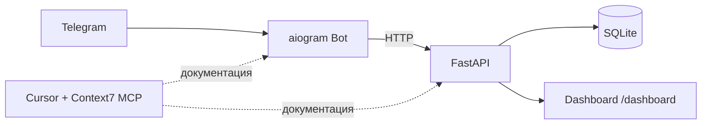

# Task Tracker

> FastAPI + aiogram + Context7 MCP — учебный проект для домашнего задания

[](https://www.python.org/)
[](https://fastapi.tiangolo.com/)
[](https://docs.aiogram.dev/)
[](https://docs.docker.com/compose/)

## Содержание

- [О проекте](#о-проекте)
- [Архитектура](#архитектура)
- [Возможности](#возможности)
- [Структура](#структура)
- [Быстрый старт](#быстрый-старт)
- [Context7 MCP](#context7-mcp)
- [Переменные окружения](#переменные-окружения)

## О проекте

| Компонент | Описание |
|-----------|----------|
| **FastAPI** | REST API + SQLite |
| **aiogram 3** | Telegram-бот с кнопками и FSM |
| **Dashboard** | Живая веб-панель запросов и задач |
| **Context7 MCP** | Актуальная документация библиотек |

## Архитектура



## Возможности

### Telegram-бот

- Кнопки: «Мои задачи», «Добавить задачу», «Статус API», «Помощь»
- FSM-диалог для создания задачи
- Inline-кнопки: «Готово» / «Удалить»
- Показывает в чате HTTP-запрос и JSON-ответ API

### API

| Метод | Endpoint | Назначение |
|-------|----------|------------|
| `GET` | `/health` | Проверка сервиса |
| `GET` | `/api/tasks` | Список задач |
| `POST` | `/api/tasks` | Создать задачу |
| `PATCH` | `/api/tasks/{id}/toggle` | Переключить статус |
| `DELETE` | `/api/tasks/{id}` | Удалить задачу |
| `GET` | `/api/stats` | Данные для dashboard |
| `GET` | `/dashboard` | Живая панель (обновление каждые 3 сек) |

## Структура

```text
api/
  main.py
  db.py
  schemas.py
  templates/dashboard.html
bot/
  main.py
  api_client.py
  keyboards.py
  states.py
.cursor/mcp.json
docker-compose.yml
```

## Быстрый старт

```powershell
Copy-Item .env.example .env
# впиши BOT_TOKEN в .env
docker compose up --build
```

**Ссылки после запуска:**

- Dashboard: [http://localhost:8000/dashboard](http://localhost:8000/dashboard)
- Swagger: [http://localhost:8000/docs](http://localhost:8000/docs)

## Context7 MCP

Файл `.cursor/mcp.json`:

```json
{
  "mcpServers": {
    "context7": {
      "command": "npx",
      "args": ["-y", "@upstash/context7-mcp@latest"]
    }
  }
}
```

## Переменные окружения

```env
BOT_TOKEN=your_telegram_bot_token
API_BASE_URL=http://api:8000
DATABASE_PATH=/data/tasks.db
```

### Пример запросов к Context7

```text
Через Context7 найди library ID для FastAPI и aiogram 3
Через Context7 покажи FSM и polling в aiogram 3
По документации Context7 сделай Task Tracker: API + бот + dashboard
```

### Что взято из Context7

- **FastAPI** — async endpoints, Pydantic models, middleware
- **aiogram 3** — `Dispatcher`, FSM, `CommandStart`, `DefaultBotProperties`, `start_polling`
